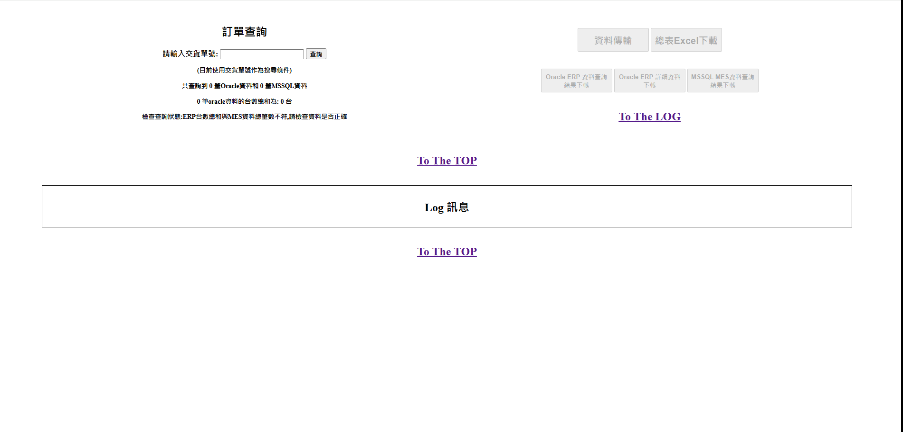
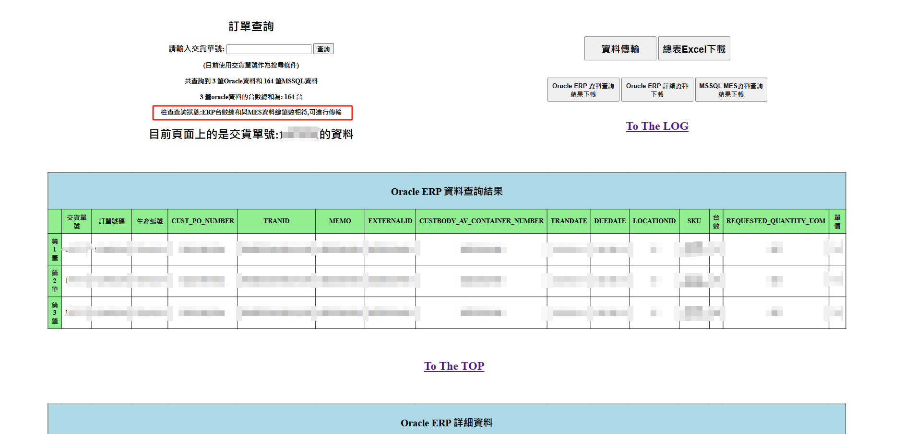
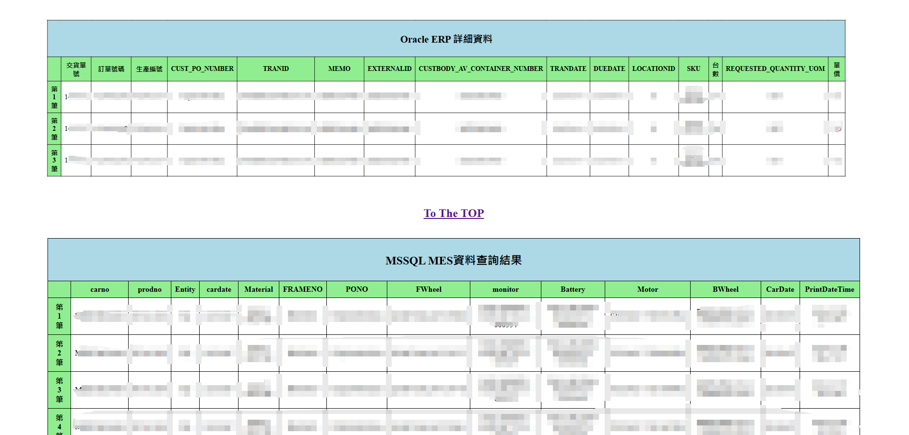
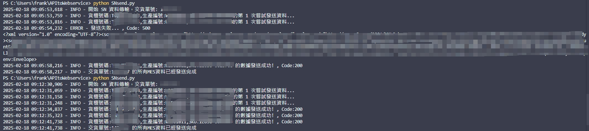

⭐ APItoWebservice API訂單推送系統

簡介:

這是一支 API 訂單推送系統，只要輸入交貨單號，即可：

    ．查詢 ORACLE 與 MS SQL 資料

    ．前端展示對應資訊

    ．可推送資料至客戶的 NetSuite 伺服器

    ．並可將結果儲存成 Excel

    ．推送成功後發送郵件至相關人員信箱

功能使用說明:

輸入交貨單號

將從ORACLE查詢對應訂單明細

根據明細裡的貨櫃號碼，查詢MS SQL裡的車輛明細

比對數量數量是否一致:

⭕數量正確  前端展示且推送按鈕可以使用

可以推送資料至客戶端NetSuite伺服器及資料儲存成Excel

❌數量錯誤  前端無資料且推送按鈕反白無法使用

最後推送成功後會自動發送信件至相關人員的信箱

✔️python 3.12 ✔️Tornado ✔️pyodbc ✔️cx_Oracle ✔️logging ✔️asyncio ✔️smtplib

✔️aiohttp ✔️datetime ✔️ElementTree ✔️queue ✔️MIMEText ✔️json ✔️模組化架構 ✔️HTML/JavaScript

專案結構:

本系統為公司內部使用，GitHub 僅展示部分合法內容，完整專案因涉公司資料恕不公開。

使用方法:

⚠️本專案為紀錄用，無法直接執行

專案學習心得:

這是我人生中第一支獨立開發的 API 訂單推送系統

公司沒有開發經驗，當然責任就由我這個剛進公司的軟體工程師接下

在沒有經驗、語法與函式庫都還不熟，也沒人能夠協助、詢問的情況下，我硬著頭皮上

從查資料、問朋友，到向 ChatGPT 求助，慢慢地摸索流程及熟悉架構

過程中挫折感很重，但我沒有想過要放棄

雖然寫得很吃力，但在開發過程中我非常開心

而在程式動起來，查詢的資料正確的那一刻，我真的非常有成就感

我原本不打算放上 GitHub，覺得自己使用AI，好像不算是自己作品

但後來我覺得，沒有我的思考與邏輯，AI 也無法寫出這支程式。

所以我決定紀錄下這份努力，因為這是我的第一個里程碑。

LOG的顯示是逐步顯示，推送進度到哪裡，就會同步顯示到哪裡
